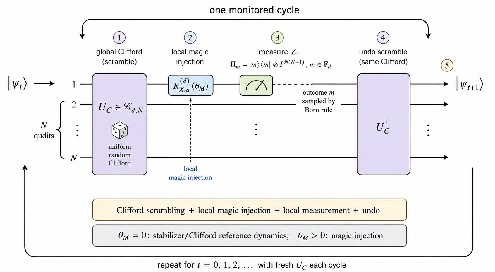

# Numerical codes for magic and entropy simulations in random monitored quantum circuits

This repository contains the numerical code for *Invariant Measures and Weak-Magic-Injection Asymptotics in Random Monitored Quantum Circuits*. The three code groups study the small-angle response of the qubit stabilizer Rényi entropy, the small-angle response of odd-prime qudit mana, and the time evolution of qutrit mana from four representative initial states.

## Monitored-circuit model

One monitored cycle samples a fresh Clifford frame, applies a local magic injection on the first qubit or qudit, measures the conjugate local Pauli axis, and returns to the public frame. The same dynamical structure is used throughout the repository.

The image is a browser preview; click it to open the [vector PDF](figures/model_schematic.pdf).

## Public-frame implementation

The programs implement the monitored cycle in the public frame instead of constructing a full random Clifford matrix. In the original description, a cycle samples a Clifford unitary `U_C`, applies the local injection along `X_1`, measures `Z_1` by the Born rule, and returns with `U_C^dagger`. Conjugating the two local axes gives

- `P_X = U_C^dagger X_1 U_C`, the injection axis;
- `P_Z = U_C^dagger Z_1 U_C`, the measurement axis.

The code therefore applies the injection directly along `P_X` and measures `P_Z`. This avoids explicitly forming the full `D x D` Clifford unitary while preserving the joint distribution of the two axes.

For prime local dimension `d`, a phase-free many-body Pauli is represented by a label `(a,b)` in the finite-field phase space and the convention `P(a,b) = tensor_j X_j^(a_j) Z_j^(b_j)`. Write `x = (a_x,b_x)` for the injection label and `z = (a_z,b_z)` for the measurement label. The sampler first draws a nonzero `x` uniformly and then draws `z` uniformly from the affine set satisfying

`symplectic bracket <x,z> = a_x dot b_z - a_z dot b_x = 1 mod d`.

For every fixed nonzero `x`, this affine set has the same number of elements, so the procedure is uniform over ordered symplectic Pauli pairs. The constraint preserves the canonical commutation relation inherited from `(X_1,Z_1)`. Under the convention used by the code, `P_Z P_X = omega P_X P_Z`, where `omega = exp(2 pi i/d)`; for qubits this reduces to the binary anticommutation sign.

A Clifford frame also carries eigenvalue labels. The implemented operators are `P_X = omega^(s_X) P(x)` and `P_Z = omega^(s_Z) P(z)`, where `s_X` and `s_Z` are sampled independently and uniformly in the local field. These spectral offsets represent the Pauli-displacement part of the labelled Clifford frame and shift the eigenvalue branches without changing the symplectic constraint.

Both the injection and the measurement are evaluated through Pauli spectral components. For a labelled Pauli `P`, the projector onto branch `m` is `Pi_m(P) = d^(-1) sum_r omega^(-m r) P^r`. The programs form all components from the Pauli orbit using a short discrete Fourier transform. The injection phases are applied to the `P_X` components and recombined; the state is then normalized. The `P_Z` components determine the Born probabilities, after which one outcome is sampled and its projected state is normalized for the next cycle.

A new ordered pair and two new offsets are sampled at every monitored cycle. The injection and measurement axes within one cycle come from the same labelled frame: they are not two independent random Pauli operators, and one frame is not reused for an entire trajectory. This direct public-frame sampler is the protocol-level replacement for explicit Clifford construction; it is not a finite-depth brick-wall approximation and has no environment-dependent sampler fallback.

The same construction underlies the Figure 3 qudit mana scan, the Figure 4 qubit 2-SRE scan, and the four-state qutrit mana dynamics. Observable evaluation is then handled by the package-specific deterministic numerical kernels: a multidimensional FFT for Gross mana and a blocked Walsh-Hadamard transform for total qubit 2-SRE.

## Repository structure

* `qubit_2sre_rotation`: **Python** code for the terminal total base-two stabilizer Rényi entropy at `N = 6, 8, 10, 12`. The self-contained script saves the released table and PNG/PDF figure; `--plot-only` redraws the figure without rerunning the trajectories.
* `qudit_mana_rotation`: **Python** code for terminal base-two Gross mana at `(d,N) = (3,2), (3,3), (3,4), (5,2)`. The self-contained script likewise saves the table and PNG/PDF figure and supports `--plot-only`.
* `four_state_mana_protocol`: **MATLAB** code for exact Gross-mana time evolution from four representative initial states at `d=3`, `N=5`, `theta_M=0.2`, and `Nr=1000`. Its canonical PNG, PDF, EPS, FIG, and MAT outputs are stored beside the script.
* `figures`: the common model schematic as a GitHub-renderable PNG and a vector PDF.

## Installation

### Python code

The Python programs were tested with **Python 3.11**. They require Python 3.8 or later, NumPy 1.21 or later, and Matplotlib 3.4 or later.

### MATLAB code

The MATLAB code in `four_state_mana_protocol` was run in **MATLAB R2024b** and uses base MATLAB functionality.

## Main entry points

* `qubit_2sre_rotation/qubit_2sre_rotation.py`: runs the Figure 4 scan, saves terminal total base-two `S2` statistics, and generates PNG/PDF outputs.
* `qudit_mana_rotation/qudit_mana_rotation.py`: runs the Figure 3 scan, saves terminal base-two mana statistics, and generates PNG/PDF outputs.
* `four_state_mana_protocol/Mana_protocol_4states_log2_embedded_0714.m`: runs the four-state qutrit mana comparison and writes the five parameterized output files beside the script.

The released Figure 3 and Figure 4 text tables contain the plotted terminal ensemble means and standard errors, allowing either figure to be checked or redrawn without repeating the full simulations. In the MATLAB package, the parameterized MAT file contains the time grid, ensemble-mean and representative-trajectory mana arrays, initial-state labels, and run metadata. PNG files provide browser previews; PDF and EPS files provide vector outputs; FIG is editable in MATLAB; and MAT contains the numerical data.
